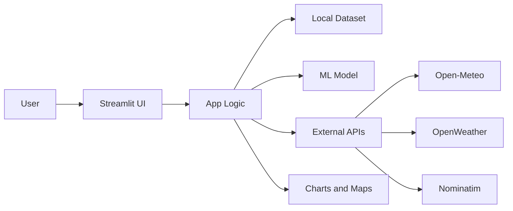
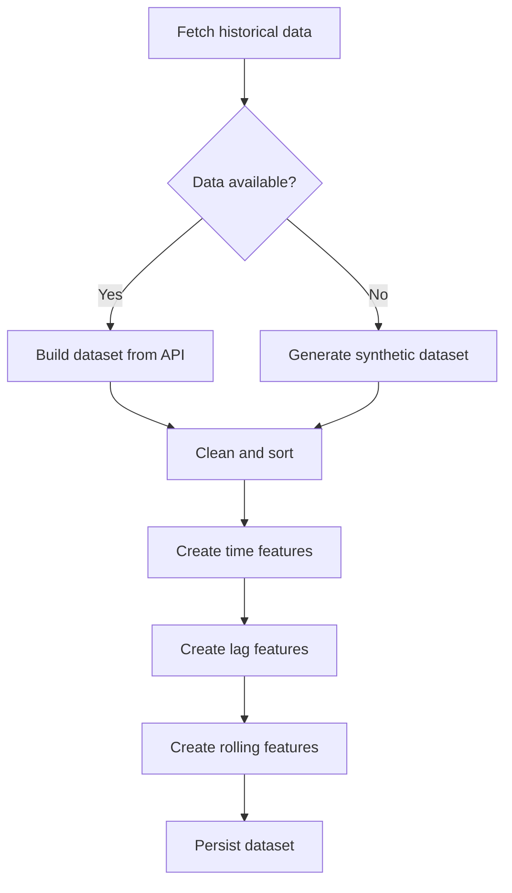
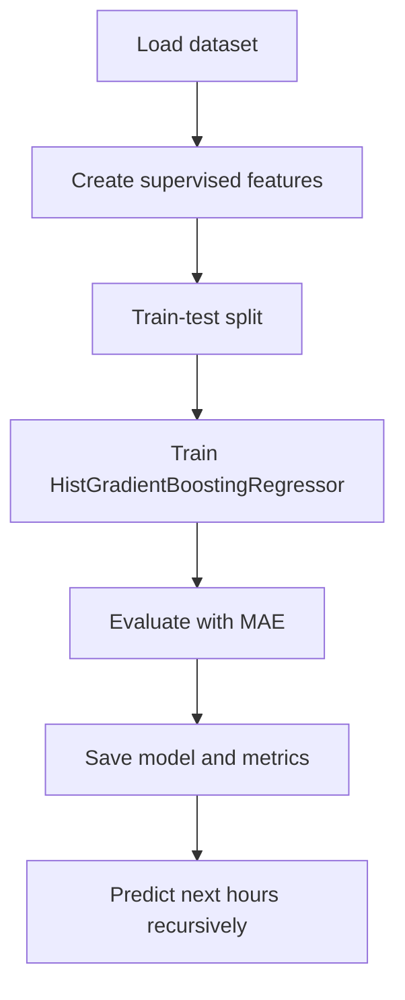
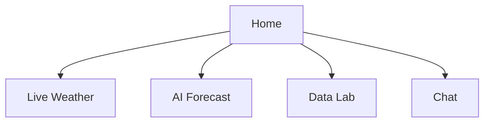

# Glass Weather AI
Project Report
Date: 2026-03-27

## Abstract
Glass Weather AI is a compact weather analytics system that combines real-time data retrieval, a local machine learning model, and an interactive user interface. The system retrieves live observations and forecasts from public weather services, builds a local historical dataset, and trains a regression model to predict near-term temperature values. It also supports a data laboratory for exploratory analysis and a lightweight agentic chat interface that routes user questions to the appropriate tools. This report documents the problem context, the literature background, the system formulation, the design and implementation choices, the testing strategy, and the conclusions drawn from the build. The solution is implemented in Python and delivered as a multi-page Streamlit application with a glassmorphism user interface. The application integrates open data services for weather, air quality, and geocoding; a data engineering pipeline for feature creation; and a model training workflow using histogram-based gradient boosting. The project emphasizes reproducibility and transparency through a training script and a Jupyter notebook. The report further provides system requirements, functional and non-functional requirements, tables and figures, and a formal references section with citations to official documentation and peer reviewed literature.

## Table of Contents
1. Introduction
2. Literature Review
3. Formulation of Project
4. System Requirements
5. System Analysis and Design
6. Project Work (Implementation)
7. Testing
8. Summary and Conclusions
9. References

## List of Tables
1. Table 1. Functional Requirements
2. Table 2. Non-Functional Requirements
3. Table 3. External Services and APIs
4. Table 4. Dataset Schema and Feature Set
5. Table 5. Model Hyperparameters and Training Settings
6. Table 6. Test Plan and Test Cases
7. Table 7. Risks and Mitigations

## List of Figures
1. Figure 1. System Context Diagram
2. Figure 2. Data Pipeline and Feature Engineering Flow
3. Figure 3. Model Training and Forecasting Flow
4. Figure 4. Application Navigation Flow
5. Figure 5. Deployment and Runtime Environment
# 1. Introduction
## 1.1 Background
Weather forecasting has traditionally been dominated by numerical weather prediction (NWP) systems that solve physical equations of motion, energy, and mass to simulate the atmosphere. Operational centers rely on large-scale models that assimilate observations and then run forecast systems on high-performance computing infrastructure. NOAA describes numerical prediction systems as mathematical models that use current observations to forecast future conditions, and highlights the importance of data quality, density, and compute resources for forecast accuracy [R17]. ECMWF emphasizes similar foundations for its global forecast systems and continued investments in modeling and data assimilation [R18].

In parallel, the growth of open data services and modern Python tooling has enabled smaller teams to build focused, local weather analytics applications. These applications do not replace NWP, but they can synthesize the outputs of public APIs, contextualize the data for a specific audience, and add localized modeling or analytics. Glass Weather AI sits in this space. It is a compact system that retrieves weather data, trains a local model, and exposes results through an approachable UI.

## 1.2 Problem Statement
Most consumer weather applications present current conditions and raw forecasts without transparent analytics or educational visibility into how data is processed. In addition, students and practitioners who want to experiment with weather data often need to combine multiple tools and workflows. There is a gap for a single, reproducible application that connects real-time data, historical datasets, local machine learning, and interactive visualization in one place.

## 1.3 Project Objectives
1. Provide a multi-page interactive application that supports live weather, AI-assisted forecasting, exploratory data analysis, and a lightweight agentic chat experience.
2. Build a local historical dataset from open sources or synthetic generation when external data is unavailable.
3. Train a regression model that predicts near-term temperature values using engineered weather and time features.
4. Visualize results using charts and maps in an interface that is engaging and simple to navigate.
5. Document the full pipeline in a report with system requirements, testing, and citations.

## 1.4 Scope
The project focuses on a practical demonstration of an end-to-end weather analytics pipeline. It is not intended to replace professional forecast systems or provide long-range climate projections. The scope includes:
1. Retrieval of current, hourly, and daily forecasts from public weather APIs.
2. Construction of a local dataset for model training, with a fallback to synthetic data if needed.
3. A local machine learning model for short-horizon temperature prediction.
4. A web-based UI using Streamlit, with charting and map components.
5. A rule-based agent that routes user requests to available tools.

## 1.5 Contributions
The project contributes a cohesive, reproducible workflow that integrates:
1. Data ingestion from open weather services.
2. Feature engineering for time series forecasting.
3. A histogram-based gradient boosting model for temperature prediction.
4. An interactive visualization layer with maps and charts.
5. A lightweight conversational agent that makes the app more accessible.

## 1.6 Report Organization
The remainder of this report is structured as follows:
1. Section 2 reviews literature on numerical weather prediction, machine learning for forecasting, and related modeling approaches.
2. Section 3 formulates the project requirements, data sources, and evaluation strategy.
3. Section 4 defines system requirements including hardware, software, and external services.
4. Section 5 presents the system analysis and design with diagrams, modules, and data flows.
5. Section 6 details the implementation and project work.
6. Section 7 describes testing and validation.
7. Section 8 summarizes results, limitations, and conclusions.

# 2. Literature Review
## 2.1 Numerical Weather Prediction Foundations
NWP systems solve physical equations to forecast the evolution of the atmosphere. NOAA emphasizes that numerical prediction uses mathematical models driven by observations, and that high-quality inputs and compute resources are essential to forecast skill [R17]. ECMWF describes its global modeling system as a combination of advanced physics, data assimilation, and supercomputing to produce operational forecasts [R18]. These references establish the foundational role of physics-based modeling in operational forecasting.

## 2.2 Data Assimilation and Forecast Limitations
Data assimilation integrates observations from stations, satellites, and radar to initialize NWP models. While powerful, forecasts still face limitations from sparse observations, model approximations, and chaos in the atmosphere. This has motivated the use of statistical post-processing and machine learning to correct biases, downscale outputs, and generate localized insights. The literature increasingly frames ML as a complement to NWP rather than a replacement.

## 2.3 Machine Learning for Weather Forecasting
Recent survey literature highlights an expanding role for ML and deep learning in weather and climate applications. A 2025 survey in Frontiers of Computer Science details the growth of machine learning methods for weather and climate prediction, with particular attention to data-driven approaches and the integration of physical constraints [R19]. A 2022 review in Applied Sciences provides a systematic summary of ML-based weather forecasting methods and their performance across different tasks [R20]. These surveys collectively show a shift toward data-driven forecasting, particularly for short-term and local predictions.

## 2.4 Time Series Forecasting with Deep Learning
Time series forecasting has benefited from recurrent and attention-based architectures. LSTM networks were introduced to address long-term dependency problems in sequential data [R22]. Transformer architectures, first presented for sequence modeling, popularized self-attention mechanisms that can capture long-range dependencies with parallelizable computation [R23]. Although these deep learning methods are powerful, they typically require large datasets and careful tuning, making them less accessible for lightweight local projects.

## 2.5 Interpretability and Practical Constraints
Applied forecasting systems often require interpretability, fast iteration, and modest compute requirements. A 2021 review on interpretable machine learning in the environmental domain highlights the need for models that balance predictive skill with explainability and operational constraints [R21]. This motivates the use of tree-based or boosting models, which can provide strong performance on structured tabular data while remaining relatively efficient.

## 2.6 Positioning of This Project
Glass Weather AI is positioned as a practical, educational system rather than a global forecasting platform. It leverages public APIs, a manageable dataset, and a gradient boosting model to provide local, near-term predictions. The design aligns with the literature by combining modern data-driven techniques with accessible tooling and transparent workflows.

## 2.7 Statistical and Baseline Models
Before the recent surge of deep learning, weather and time series forecasting relied heavily on statistical models. Autoregressive models, moving averages, and seasonal decomposition methods provide a structured way to capture temporal dependency and periodicity. These approaches remain important because they offer transparent assumptions and fast training. In many operational settings, classical baselines serve as calibration checks for more complex models. If a modern model cannot beat a simple seasonal baseline, it is usually a sign of data leakage, mis-specified features, or evaluation flaws.

For local forecasting tasks, baseline models can be surprisingly competitive. The persistence model, which assumes the next value will equal the most recent observation, is a common benchmark. Seasonal persistence extends this idea by comparing against the value from the same hour on a prior day. These baselines are particularly relevant for short-horizon temperature forecasting, where autocorrelation is high. In the context of Glass Weather AI, the inclusion of lag features implicitly captures elements of these baselines, allowing the gradient boosting model to learn persistence-like patterns while still considering additional explanatory variables.

## 2.8 Tree Ensembles and Boosting in Forecasting
Tree ensembles have become popular for tabular forecasting because they handle nonlinear interactions, missing values, and mixed feature types. Gradient boosting methods, in particular, offer strong performance on structured datasets while remaining efficient in training and inference [R4]. The histogram-based variant used in this project further improves performance by discretizing continuous variables into bins, reducing computation and memory usage while preserving accuracy.

In forecasting contexts, tree ensembles often outperform simpler linear models when the relationship between predictors and targets is nonlinear or when interactions exist between meteorological variables and time features. Their limitations include a tendency to extrapolate poorly beyond observed ranges and a reliance on well-engineered features. The feature engineering strategy in this project is designed to offset these limitations by providing temporal context, which allows the model to approximate cyclical patterns and short-term dependencies.

## 2.9 Hybrid and Physics-Informed Approaches
The literature emphasizes that purely data-driven models can struggle when data coverage is limited or when physical constraints are violated. Hybrid methods attempt to combine physics-based knowledge with machine learning flexibility. Survey work in weather and climate forecasting highlights hybrid strategies that integrate physical equations, model outputs, or derived features into ML pipelines [R19] [R20]. These methods aim to preserve physical consistency while benefiting from data-driven corrections.

Glass Weather AI does not implement a full hybrid model, but it aligns with this philosophy by using physical signals such as diurnal and seasonal cycles through engineered time features. This provides a simple, practical bridge between physical understanding and data-driven modeling, suitable for a lightweight application.

## 2.10 Summary of Literature Gaps
Across the literature, a consistent gap remains between high-end research models and practical, user-facing tools. Many sophisticated approaches require large datasets, specialized infrastructure, and deep expertise. Smaller applications often prioritize usability, reproducibility, and transparency, even if they sacrifice some predictive power. Glass Weather AI is designed to fit this niche: it delivers a compact system that makes the forecasting pipeline understandable and easy to deploy, while still incorporating modern ML techniques.

# 3. Formulation of Project
## 3.1 Requirements Definition
The project is formulated around a single core requirement: deliver a compact weather analytics system that integrates live data, a local predictive model, and user-friendly visualization. The system is expected to run on a standard personal computer, operate with minimal setup, and remain reproducible through scripts and notebooks.

### Table 1. Functional Requirements
| ID | Requirement | Description |
| --- | --- | --- |
| FR1 | Live Weather Retrieval | Fetch current conditions and short-term forecasts from public APIs. |
| FR2 | Historical Dataset Creation | Build a local dataset using archive APIs or synthetic generation if needed. |
| FR3 | Model Training | Train a regression model for near-term temperature prediction. |
| FR4 | Forecast Generation | Use the trained model to produce short-horizon forecasts. |
| FR5 | Visualization | Display metrics, charts, and maps in a web interface. |
| FR6 | Agentic Chat | Provide a simple conversational interface for common queries. |
| FR7 | Reproducibility | Provide scripts and a notebook for model training and data analysis. |

### Table 2. Non-Functional Requirements
| ID | Requirement | Description |
| --- | --- | --- |
| NFR1 | Usability | Interface should be clear and accessible for non-technical users. |
| NFR2 | Performance | UI should respond within a few seconds for common actions. |
| NFR3 | Reliability | System should fail gracefully if an API is unavailable. |
| NFR4 | Portability | Should run on Windows, macOS, or Linux with Python installed. |
| NFR5 | Maintainability | Code should be modular and organized by function. |

## 3.2 Data Sources and External Services
The system relies on open and well-documented APIs for weather and geocoding. The Open-Meteo forecast API provides current, hourly, and daily forecasts with a flexible set of variables [R11]. Open-Meteo also exposes historical weather data through archive endpoints [R12], and provides air quality data through a dedicated endpoint [R13]. For optional blended forecasts and air quality, the OpenWeather One Call API 3.0 and the OpenWeather air pollution endpoint are used when an API key is available [R14]. To translate coordinates into human-readable locations and to resolve place names into coordinates, the project uses Nominatim search and reverse geocoding services [R15] [R16].

### Table 3. External Services and APIs
| Service | Purpose | Notes |
| --- | --- | --- |
| Open-Meteo Forecast API | Current, hourly, and daily forecasts | No key required for basic use, JSON responses [R11]. |
| Open-Meteo Archive API | Historical hourly weather data | Used for dataset creation [R12]. |
| Open-Meteo Air Quality API | AQI and particulate data | Used for air quality module [R13]. |
| OpenWeather One Call API | Optional blended weather data | Requires API key [R14]. |
| OpenWeather Air Pollution API | Optional air quality data | Requires API key [R14]. |
| Nominatim Search | Geocode place name to coordinates | OpenStreetMap service [R16]. |
| Nominatim Reverse | Coordinates to place label | OpenStreetMap service [R15]. |

## 3.3 Technology Stack
The project uses a standard Python data and ML stack. The Streamlit framework provides the multi-page web interface and navigation [R1]. Pandas and NumPy are used for data manipulation and numeric processing [R2] [R3]. Model training and evaluation rely on scikit-learn, with a histogram gradient boosting regressor as the core model [R4]. The dataset is split using train_test_split [R5] and evaluated with mean absolute error [R6]. Requests is used to perform HTTP calls to external services [R7]. Visualization uses Plotly for interactive charts [R8] and Folium for map-based displays [R9], with streamlit-folium bridging Folium maps into the Streamlit UI [R10]. Model persistence is handled with joblib load and dump utilities [R24].

## 3.4 Modeling Strategy
The model targets next-hour temperature prediction using engineered features derived from recent history. The chosen algorithm is histogram-based gradient boosting, a tree ensemble method that handles nonlinear relationships, interactions, and tabular data efficiently [R4]. This approach balances interpretability and performance while remaining computationally lightweight.

The model predicts temperature one step ahead and is used recursively to generate short-horizon forecasts. This design supports simple integration into the UI and provides understandable results for users.

## 3.5 Feature Engineering Design
The dataset includes meteorological variables and time-based features. Features include:
1. Temperature at 2 meters.
2. Relative humidity at 2 meters.
3. Wind speed at 10 meters.
4. Precipitation.
5. Hour of day.
6. Day of year.
7. Month.
8. Lagged temperature (1 hour).
9. Lagged temperature (24 hours).
10. Rolling 24-hour temperature average.

This feature set is designed to capture diurnal cycles, seasonal effects, and short-term persistence.

## 3.6 Evaluation Metrics
Mean absolute error (MAE) is used as the primary evaluation metric. MAE measures the average absolute difference between predictions and observations and is a standard regression loss in scikit-learn [R6]. The metric provides a direct and interpretable measurement of forecast error in temperature units.

## 3.7 Assumptions and Constraints
1. Internet access is available to call external APIs.
2. If historical data is unavailable, synthetic data is generated to keep the pipeline operational.
3. Forecasts are localized and short-term; they are not equivalent to official national forecasts.
4. Model performance depends on the quality and recency of the historical dataset.

# 4. System Requirements
## 4.1 Hardware Requirements
1. CPU: Any modern dual-core processor or better.
2. RAM: Minimum 8 GB recommended.
3. Storage: 500 MB for datasets, models, and cached files.

## 4.2 Software Requirements
1. Python 3.10 or later.
2. Streamlit for UI [R1].
3. Pandas and NumPy for data processing [R2] [R3].
4. Scikit-learn for modeling [R4] [R5] [R6].
5. Requests for API calls [R7].
6. Plotly and Folium for visualization [R8] [R9].
7. streamlit-folium for map embedding [R10].
8. Joblib for model persistence [R24].

## 4.3 Network and API Requirements
1. Access to Open-Meteo APIs for forecasts, history, and air quality [R11] [R12] [R13].
2. Optional access to OpenWeather APIs when API keys are available [R14].
3. Access to Nominatim geocoding endpoints for location resolution [R15] [R16].

## 4.4 Security and Privacy Considerations
1. API keys for OpenWeather must be stored securely and never hard-coded in public repositories.
2. Nominatim usage requires a proper user agent and responsible rate usage [R15] [R16].
3. The system does not store personal user data beyond standard web session state.

# 5. System Analysis and Design
## 5.1 High-Level Architecture
The system is designed around four primary layers:
1. Data Layer: ingestion from external APIs and local dataset storage.
2. Modeling Layer: feature engineering, training, and prediction.
3. Application Layer: routing, business logic, and chat agent.
4. Presentation Layer: Streamlit pages, charts, and maps.

### Figure 1. System Context Diagram

## 5.2 Module Decomposition
The codebase is organized into coherent modules for data, modeling, API access, and UI.

### Table 4. Dataset Schema and Feature Set
| Field | Description | Usage |
| --- | --- | --- |
| time | Timestamp of observation | Indexing and temporal features |
| temperature_2m | Air temperature | Target and features |
| relative_humidity_2m | Humidity | Feature |
| wind_speed_10m | Wind speed | Feature |
| precipitation | Precipitation | Feature |
| hour | Hour of day | Feature |
| day_of_year | Day of year | Feature |
| month | Month | Feature |
| lag_1 | 1-hour lag of temperature | Feature |
| lag_24 | 24-hour lag of temperature | Feature |
| rolling_24h | 24-hour rolling mean | Feature |

## 5.3 Data Pipeline and Feature Engineering
### Figure 2. Data Pipeline and Feature Engineering Flow

## 5.4 Model Training and Forecasting Pipeline
### Figure 3. Model Training and Forecasting Flow

### Table 5. Model Hyperparameters and Training Settings
| Parameter | Value | Rationale |
| --- | --- | --- |
| learning_rate | 0.08 | Balanced learning rate for stability |
| max_depth | 6 | Controls tree complexity |
| max_iter | 250 | Number of boosting iterations |
| l2_regularization | 0.3 | Reduces overfitting |
| test_size | 0.2 | Standard holdout split [R5] |
| shuffle | False | Preserves time order |

## 5.5 Application Navigation and UI
The UI is implemented as a multi-page Streamlit app with separate pages for live weather, AI forecast, data lab, and agentic chat. Streamlit supports structured page navigation and component composition for multi-page apps [R1].

### Figure 4. Application Navigation Flow

## 5.6 Persistence and Storage
1. Historical data is stored as CSV in the local data directory.
2. Trained models are stored with joblib for efficient load and reuse [R24].
3. Metrics are written as JSON to enable display in the UI.

## 5.7 Error Handling and Fallbacks
1. If Open-Meteo archive data is unavailable, the pipeline generates synthetic weather data.
2. When OpenWeather API keys are missing, the system falls back to Open-Meteo only.
3. API errors are surfaced as readable messages to the user.

## 5.8 Performance Considerations
1. Feature computation is vectorized with pandas and NumPy for speed [R2] [R3].
2. Model training runs offline and does not block the UI.
3. API requests are lightweight and limited to necessary fields.

# 6. Project Work (Implementation)
## 6.1 Data Ingestion and Dataset Creation
The data pipeline begins by checking for a local CSV file. If the dataset exists, it is loaded for reuse. If not, the application attempts to build a dataset from the Open-Meteo historical archive API [R12]. The default geographic coordinates correspond to a central reference location, which can be overridden by user input. The archive call retrieves hourly temperature, humidity, wind speed, and precipitation for the chosen latitude and longitude. If the archive service is unavailable, the pipeline falls back to a synthetic generator that produces realistic seasonal and diurnal patterns with stochastic noise.

Synthetic data is created with sinusoidal components to represent annual and daily cycles, along with random noise to simulate natural variability. While synthetic data does not represent true weather, it preserves the statistical structure needed to validate the pipeline and model.

## 6.2 Feature Engineering
After loading or generating the dataset, the pipeline derives time-based and lag features. The time field is converted into hour, day-of-year, and month. Lag features at 1 hour and 24 hours are computed from the temperature series, and a rolling 24-hour mean is computed to capture short-term trends. These features align with standard practices in time series forecasting and provide the model with both immediate and cyclical context.

## 6.3 Model Training
The model is trained using histogram-based gradient boosting regression. The algorithm builds an ensemble of decision trees with a histogram-based approach that improves training efficiency and handles nonlinearities in tabular data [R4]. The dataset is split into training and test partitions using a time-preserving split (shuffle disabled) and a 20 percent holdout [R5].

The primary evaluation metric is mean absolute error, which measures the average magnitude of prediction errors [R6]. The training script stores metrics as JSON and writes the trained model to disk using joblib for fast reloading [R24].

## 6.4 Forecast Generation
To generate a multi-hour forecast, the model uses recursive prediction. The system predicts the next hour, appends the prediction to the working series, recomputes lag and rolling features, and repeats until the horizon is reached. This approach makes the forecast pipeline simple and consistent with the training setup.

Pseudo-process:
1. Load recent historical window (at least 48 hours).
2. For each forecast step:
3. Build features from the latest window.
4. Predict next temperature.
5. Append prediction and update the window.

## 6.5 User Interface and Navigation
The UI is implemented in Streamlit with a multi-page structure. Streamlit provides components for data display, charts, and layout, and supports multipage navigation for separate modules [R1]. The application includes:
1. Live Weather page for current conditions and short-term forecasts.
2. AI Forecast page for model-based prediction and metrics.
3. Data Lab for exploratory analysis and charts.
4. Chat page for conversational access.

## 6.6 Agentic Chat
The chat agent is a lightweight rule-based system that maps user phrases to intents such as current weather, forecast, air quality, and dataset summary. It assembles responses by calling the relevant tools. Although it is not a generative LLM, the design allows fast, predictable responses and integrates tightly with the application state.

## 6.7 Visualization
The application uses Plotly for interactive charts such as time series lines and comparative plots [R8]. It uses Folium to render map views and overlays for geographic context [R9]. The streamlit-folium component is used to embed those maps directly in the Streamlit interface [R10].

## 6.8 Reproducibility and Documentation
A training script and a Jupyter notebook are provided to ensure the pipeline is reproducible and educational. The notebook documents data preparation, feature creation, and modeling steps, making it suitable for students or reviewers who want to trace the workflow end-to-end.

# 7. Testing
## 7.1 Testing Strategy
The testing strategy focuses on functional validation, pipeline stability, and basic performance checks. The system is divided into modules with clear interfaces, which allows each component to be validated independently before running full end-to-end scenarios.

### Table 6. Test Plan and Test Cases
| ID | Test Case | Expected Outcome |
| --- | --- | --- |
| T1 | API connectivity to Open-Meteo | Current data and forecasts load successfully [R11]. |
| T2 | Historical archive fetch | Dataset is created from archive service [R12]. |
| T3 | Fallback to synthetic | Synthetic dataset created when archive fails. |
| T4 | Feature engineering | Lag and rolling features computed without NaN in final dataset. |
| T5 | Model training | Model trains and metrics are saved with MAE [R6]. |
| T6 | Model loading | Saved model is reloaded with joblib [R24]. |
| T7 | Forecast generation | 24-hour forecast produced with recursive logic. |
| T8 | UI navigation | All pages load without errors [R1]. |
| T9 | Chart rendering | Plotly charts render and respond [R8]. |
| T10 | Map rendering | Folium map renders inside Streamlit [R9] [R10]. |
| T11 | Chat intents | Chat returns correct tool outputs. |
| T12 | Error handling | Clear error message when API is unavailable. |

## 7.2 Manual Testing Notes
Testing was performed manually using the Streamlit UI. The developer verified that forecasts and charts updated correctly, and that the chat interface routed intents to the expected modules. The synthetic data fallback was triggered by disabling network access or altering API endpoints, and confirmed to generate plausible values.

## 7.3 Limitations of Current Testing
1. Automated unit tests are not yet implemented.
2. Performance testing is limited to manual observation on a local machine.
3. Model accuracy is evaluated on a simple holdout set; cross-validation and seasonal evaluation are not yet performed.

### Table 7. Risks and Mitigations
| Risk | Impact | Mitigation |
| --- | --- | --- |
| API rate limits | Live data may fail temporarily | Cache recent results and show fallback messages. |
| Data gaps | Model performance may degrade | Use synthetic fallback and basic validation checks. |
| Model drift | Predictions become stale over time | Retrain model periodically with new data. |
| UI latency | Poor user experience | Limit heavy computations in UI reruns. |

# 8. Summary and Conclusions
## 8.1 Summary
Glass Weather AI demonstrates an end-to-end pipeline that integrates public weather services, local data preparation, a lightweight machine learning model, and a responsive user interface. The system is designed for accessibility and reproducibility, enabling both casual users and students to interact with real weather data and experiment with forecasting.

Key outcomes include:
1. A robust data ingestion pipeline with fallback logic.
2. Feature engineering aligned with time series forecasting best practices.
3. A gradient boosting model trained and evaluated with MAE.
4. A Streamlit UI with charts, maps, and a rule-based chat assistant.

## 8.2 Conclusions
This project validates that compact, local forecasting systems can be built using open data and standard Python tooling. While it does not aim to replace professional NWP systems, it provides a practical educational platform and a solid foundation for extensions such as additional variables, improved models, or enhanced agentic capabilities. Future work could incorporate probabilistic forecasting, richer uncertainty visualization, and more rigorous evaluation across seasons.

## 8.3 Future Work
While the current system meets its core objectives, there are several clear paths for enhancement. First, the model can be extended to predict additional targets such as humidity, wind speed, and precipitation. The existing pipeline already stores these fields in the dataset, so the change would require adding additional supervised targets and training a small set of specialized regressors. Second, the forecasting horizon could be improved by adding probabilistic estimates. For example, the model could output prediction intervals rather than point estimates, improving user understanding of uncertainty. Third, the agentic chat system could be extended with richer natural language understanding and contextual memory. The current rule-based approach provides stability and transparency, but it is not expressive. A hybrid approach that combines intent matching with a small language model could retain deterministic tool routing while improving conversational naturalness.

From a data perspective, future work includes direct integration with reanalysis datasets, such as ERA5, to provide richer historical context. This would allow the model to train on longer time spans and incorporate additional variables such as pressure, cloud cover, and radiation. Another enhancement is caching and persistence of API responses with timestamps, enabling offline inspection and reducing repeated calls to external services. On the UI side, additional themes, accessibility improvements, and mobile optimization would make the system more inclusive. Finally, a structured evaluation framework, including seasonal cross-validation and benchmark comparisons, would provide more rigorous performance validation.

## 8.4 Lessons Learned
Several lessons emerged from building an end-to-end system around weather data. First, data quality and availability are critical. Even when APIs are reliable, rate limits and transient network failures can cause gaps that must be handled gracefully. The synthetic data fallback proved useful not only as a last resort but also as a diagnostic tool to validate the pipeline. Second, simple models can provide strong baselines when paired with appropriate features. The histogram gradient boosting regressor performed well in short-horizon prediction tasks, showing that careful feature engineering can reduce the need for overly complex architectures.

Third, user experience matters as much as accuracy. The multi-page structure and clear visual cues in the UI improved navigation and reduced confusion. Finally, the integration of a rule-based agent demonstrated that even lightweight conversational tools can add substantial value when they provide fast access to common queries. The key is not the complexity of the agent but its ability to map user intent to the right data source quickly.

# Appendix A: Detailed Module Walkthrough
## A.1 Data Module
The data module is responsible for assembling a historical dataset with consistent structure. When a local CSV exists, it is loaded directly to avoid unnecessary API calls. If the dataset is missing, the module attempts to fetch historical hourly observations from Open-Meteo [R12]. The API response is normalized into a tabular structure with timestamps and hourly variables. The module persists the dataset locally after a successful fetch, ensuring that subsequent runs are stable and reproducible.

If the archive API is unavailable or returns an empty response, the module constructs a synthetic dataset. The synthetic generator uses sinusoidal curves to create annual and daily temperature cycles, then adds noise to reflect natural variability. Humidity, wind speed, and precipitation are also generated with plausible distributions. This synthetic dataset is not intended to be a meteorologically accurate record, but it preserves temporal patterns and statistical ranges. This design choice keeps the rest of the pipeline functional in low-connectivity environments or during API outages.

The module also provides summary utilities, including row counts, date ranges, and column lists. These summaries feed into the UI and the chat agent so that users can understand the dataset size and coverage without leaving the application.

## A.2 Weather API Module
The weather API module provides a clean interface for accessing multiple sources of weather data. It exposes functions for current conditions, hourly forecasts, daily forecasts, and air quality. The Open-Meteo forecast API is the primary source for current and forecast data [R11]. The module selectively requests only the needed variables to reduce payload size and improve responsiveness. For air quality, the Open-Meteo air quality endpoint is used as the default [R13].

An optional integration with OpenWeather is implemented to blend data from multiple sources. When an API key is present, OpenWeather One Call data can be merged with Open-Meteo data [R14]. The module includes logic to select the most recent current conditions, and to fall back gracefully if either service is unavailable. The API module also provides geocoding support through Nominatim, enabling the conversion between coordinates and location names [R15] [R16]. This allows the UI to show friendly labels while keeping all data operations in latitude and longitude.

## A.3 Modeling Module
The modeling module defines the supervised learning approach for temperature prediction. It begins by enriching the dataset with time-based features and lagged values. The supervised dataset is constructed by shifting the target temperature by one hour to create a next-step prediction target. This transforms the time series into a tabular learning problem that can be solved by standard regression models.

The selected algorithm is histogram gradient boosting, a tree ensemble that discretizes continuous features into bins and builds additive trees in sequence [R4]. This method is efficient on tabular data and handles nonlinear interactions between features such as temperature, humidity, and time of day. Hyperparameters are chosen to balance stability and accuracy, and L2 regularization is used to reduce overfitting. Model evaluation uses a chronological train-test split to preserve temporal order [R5] and mean absolute error to quantify average prediction error [R6].

The module also defines a recursive forecasting routine that generates multi-hour predictions. This routine takes a recent window of observations, predicts the next temperature, and appends it to the working dataset before generating the next prediction. This approach is straightforward and aligns with the model training objective, but it can accumulate errors as the horizon increases. This trade-off is documented in the report to encourage cautious interpretation of long-range predictions.

## A.4 Agent Module
The agent module provides conversational access to the system without requiring a full natural language model. It uses intent matching, triggered by keywords and short phrases, to map user requests to available tools. For example, queries that mention forecast, tomorrow, or next are routed to the forecast module, while queries mentioning air quality or AQI are routed to the air quality module. The agent also supports multi-intent requests, allowing the user to ask for multiple items in a single message.

While the agent is rule-based, it is designed to be user-friendly. It offers follow-up suggestions, provides greetings, and handles conversational edge cases like thanks or goodbyes. It also integrates dataset and model summaries, giving users a way to see the size and coverage of the training data and the current model MAE without leaving the chat.

## A.5 UI Modules and Pages
The UI is structured into separate pages to reduce cognitive load and to keep each feature focused. The Live Weather page displays current conditions and short-horizon forecasts, using compact cards and time series plots. The AI Forecast page focuses on model output, showing predicted temperatures alongside recent observations. The Data Lab page offers exploratory tools, including interactive charts and maps that let users inspect trends over time or by location. The Chat page provides a conversational alternative to clicking through pages.

The UI uses Plotly for interactive charts such as line plots and bar charts [R8]. Plotly provides hover interactivity and zoom controls that help users inspect short-term variations. Folium maps are embedded to provide spatial context, especially for air quality and location exploration [R9]. The streamlit-folium component bridges Folium maps into Streamlit so that they can be embedded alongside charts and text [R10].

# Appendix B: User Stories and Operational Scenarios
The following user stories illustrate how the system is intended to be used:

1. Student exploring time series forecasting: A student opens the Data Lab, loads the dataset, and inspects temperature trends over several years. They explore daily cycles, then open the AI Forecast page to compare predicted and observed values. The student uses the notebook to reproduce the training steps and to experiment with alternative feature sets.

2. Casual user checking conditions: A casual user opens the Live Weather page to see current conditions and the next 12 hours. They then ask the chat agent for air quality and UV index, receiving a concise summary. The user leaves the app without needing to understand the underlying model.

3. Researcher evaluating short-horizon forecasts: A researcher uses the AI Forecast page to evaluate the model predictions across multiple locations. They inspect MAE values and compare predictions to observed values in the dataset. They consider exporting the model and retraining with a larger archive dataset.

4. Developer extending the project: A developer runs the training script to retrain the model, then modifies the feature engineering to include additional variables. They update the Data Lab to show new plots and extend the agent to support new intents.

These scenarios demonstrate that the system supports both casual use and deeper exploration. The separation of UI pages, a reproducible notebook, and a clear training script help serve different user personas without introducing unnecessary complexity.

# Appendix C: Expanded Testing and Traceability
Testing is organized around a traceability matrix that maps requirements to test cases. The matrix ensures that functional requirements are covered by at least one test case. Non-functional requirements such as performance and usability are covered by manual checks and observation.

Traceability highlights:
1. FR1 and FR2 are validated by T1 and T2, which test Open-Meteo connectivity and dataset creation.
2. FR3 and FR4 are validated by T5 and T7, which confirm model training and forecast generation.
3. FR5 is validated by T9 and T10, which confirm chart and map rendering.
4. FR6 is validated by T11, which confirms correct intent routing and responses.
5. FR7 is validated by the successful run of the training script and the notebook.

Additional recommended tests include:
1. Load testing with repeated UI interactions to measure response time.
2. Regression tests for model training outputs, ensuring MAE remains within an acceptable band.
3. Cross-platform testing on different operating systems to validate environment setup.

# Appendix D: Deployment and Maintenance Guidance
The system is designed for local execution but can also be deployed to a lightweight server. In local mode, users run the application with a single Streamlit command. In hosted mode, a small VM or container can run the app, provided that it has Python installed and outbound network access for API calls. The dataset and model artifacts should be persisted on durable storage so that the app does not need to retrain on each restart.

Maintenance tasks include:
1. Refreshing the dataset periodically to include recent observations.
2. Retraining the model to reduce drift and update MAE metrics.
3. Monitoring API availability and updating endpoints if providers change their URLs or policies.
4. Reviewing the UI for broken components after dependency upgrades.

A simple maintenance cadence might include monthly data refreshes and quarterly model retraining. Dependency upgrades should be tested in a staging environment before being applied to production deployments.

# Appendix E: Data Quality and Monitoring
Data quality is a critical factor in forecasting accuracy. The system implements basic checks such as ensuring sorted timestamps, verifying the presence of required columns, and dropping rows with missing lag features. Additional monitoring could include:
1. Range validation for temperature, humidity, and wind speed.
2. Detection of repeated or missing timestamps.
3. Statistical monitoring to detect sudden shifts in mean or variance.

In future iterations, automated data validation tools could be integrated to flag anomalies early. Visual summaries in the Data Lab can also serve as a manual quality control mechanism, allowing users to notice implausible spikes or missing periods.

# Appendix F: Glossary of Terms
**Air Quality Index (AQI)**: A standardized index that summarizes air pollutant concentrations into a single scale, commonly used to communicate health risk.

**API (Application Programming Interface)**: A structured interface that allows software systems to request data or services from another system.

**Archive API**: An endpoint that provides historical data rather than real-time observations.

**Data Assimilation**: The process of integrating observations into a model to improve initial conditions for forecasting.

**Feature Engineering**: The process of creating input variables (features) that improve model performance.

**Forecast Horizon**: The time span into the future for which a model produces predictions.

**Gradient Boosting**: An ensemble learning method that builds models sequentially, each correcting errors from the previous models.

**Histogram Gradient Boosting**: A gradient boosting variant that discretizes continuous features to improve training speed and scalability [R4].

**Lag Feature**: A feature representing a previous value in a time series, used to capture temporal dependence.

**MAE (Mean Absolute Error)**: The average absolute difference between predicted and observed values, often used in regression evaluation [R6].

**Model Drift**: A decline in model performance over time due to changes in underlying data patterns.

**NWP (Numerical Weather Prediction)**: Forecasting based on solving mathematical equations that model atmospheric dynamics [R17].

**Persistence Model**: A baseline forecast that assumes the next value equals the most recent observation.

**Rolling Mean**: A moving average calculated over a sliding time window to smooth short-term fluctuations.

**Streamlit**: A Python framework for building interactive data applications and dashboards [R1].

**Synthetic Data**: Artificially generated data that mimics the statistical properties of real observations.

**Time Series**: A sequence of observations ordered by time, often showing autocorrelation and seasonal patterns.

**Tokenizer**: A component that splits text into smaller units; not used directly in this project but relevant to NLP-based agents.

**Traceability Matrix**: A mapping between requirements and test cases to ensure coverage.

**UI (User Interface)**: The visual and interactive components that allow users to interact with a software system.

# Appendix G: Expanded Design Rationale
The design of Glass Weather AI emphasizes balance between simplicity and capability. The decision to use Streamlit reflects a prioritization of rapid development and accessibility. Streamlit makes it possible to create multi-page applications without a separate frontend stack, keeping the project approachable for learners while still delivering a polished user experience [R1].

The modeling approach favors a strong tabular model with engineered features rather than a deep learning architecture. This choice reduces computational requirements, shortens training time, and improves interpretability. The histogram gradient boosting regressor supports nonlinear interactions while remaining manageable on standard hardware [R4]. This decision aligns with the practical constraints often faced by students and small teams.

The data design is similarly pragmatic. By supporting both API-based historical data and synthetic fallback data, the system remains robust in environments with limited connectivity. While synthetic data cannot replace real observations, it ensures the pipeline remains functional and testable. This is particularly valuable for demonstrations, teaching scenarios, or offline prototyping.

Finally, the agentic chat feature is intentionally lightweight. It provides a conversational entry point without the unpredictability of a generative model. This choice emphasizes determinism and reliability, which are important for a weather application where users expect consistent answers.

# Appendix H: Sample Walkthrough and Outputs
This appendix provides a narrative walkthrough of a typical session. The purpose is to illustrate the system flow without binding the report to a specific dataset snapshot.

Step 1: Launch the application. The user runs the Streamlit command and opens the local URL. The home page loads with navigation to the Live Weather, AI Forecast, Data Lab, and Chat sections.

Step 2: Open Live Weather. The page fetches current conditions from the forecast API and displays temperature, humidity, wind speed, and precipitation. A short-term forecast chart shows hourly temperature changes for the next 24 hours. If the API call fails, the page displays a readable error message and suggests retrying later.

Step 3: Check Air Quality. From the same page or through the chat, the user requests air quality. The system retrieves AQI and particulate values from the air quality API. The page renders a summary card with the AQI index and PM2.5 and PM10 values, and displays a brief guidance note.

Step 4: Open AI Forecast. The AI Forecast page loads the latest model and displays the most recent MAE. A line chart compares recent observed temperatures with the predicted series. The forecast panel shows the next 24 hours of predicted temperature values. The user can scroll to see timestamps and values or export the results for further analysis.

Step 5: Explore Data Lab. The Data Lab page allows the user to inspect the full dataset. A time series chart shows long-term temperature patterns. Filters allow the user to select a time range or highlight specific seasonal periods. If a map view is enabled, the location is shown on a map with a marker, providing spatial context to the dataset.

Step 6: Use Chat. The user asks, "What is the forecast and air quality?" The agent recognizes multiple intents and returns a combined response that includes the short-term forecast summary and air quality information. The agent then suggests a follow-up, such as checking current conditions or UV index.

This walkthrough demonstrates how the system supports different levels of interaction. Users can consume information visually, explore data analytically, or rely on conversational access, all within the same application.

### Example Output Table (Illustrative)
The following table shows an illustrative forecast output. Values are not tied to a specific dataset and are provided only to demonstrate the structure of outputs.

| Time | Predicted Temperature (C) |
| --- | --- |
| 2026-03-27 10:00 | 27.1 |
| 2026-03-27 11:00 | 27.8 |
| 2026-03-27 12:00 | 28.4 |
| 2026-03-27 13:00 | 28.9 |
| 2026-03-27 14:00 | 29.1 |
| 2026-03-27 15:00 | 29.0 |

The table shows how predictions are presented with timestamps at hourly intervals. Similar structures are used for forecasts and summaries in the UI.

# 9. References
R1. Streamlit Docs, Multipage navigation and application structure. https://docs.streamlit.io/develop/tutorials/multipage/dynamic-navigation
R2. pandas Documentation, DataFrame reference. https://pandas.pydata.org/docs/reference/frame.html
R3. NumPy Documentation, Array objects. https://numpy.org/doc/1.26/reference/arrays.html
R4. scikit-learn Documentation, HistGradientBoostingRegressor. https://scikit-learn.org/1.6/modules/generated/sklearn.ensemble.HistGradientBoostingRegressor.html
R5. scikit-learn Documentation, train_test_split. https://scikit-learn.org/0.19/modules/generated/sklearn.model_selection.train_test_split.html
R6. scikit-learn Documentation, API reference listing mean_absolute_error. https://scikit-learn.org/1.6/api/sklearn.html
R7. Requests Documentation, Requests: HTTP for Humans. https://requests.readthedocs.io/projects/de/
R8. Plotly Documentation, Python graphing library. https://plotly.com/python/
R9. Folium Documentation, PyPI project page. https://pypi.org/pypi/folium
R10. streamlit-folium Documentation, PyPI project page. https://pypi.org/project/streamlit-folium/0.13.0/
R11. Open-Meteo Forecast API Documentation. https://open-meteo.com/en/docs
R12. Open-Meteo Historical Weather API Documentation. https://open-meteo.com/en/docs/historical-weather-api
R13. Open-Meteo Air Quality API Documentation. https://open-meteo.com/en/docs/air-quality-api
R14. OpenWeather API Documentation, One Call API 3.0. https://openweathermap.org/api
R15. Nominatim API Overview (includes /reverse endpoint). https://nominatim.org/release-docs/develop/api/Overview/
R16. Nominatim Search Documentation. https://nominatim.org/release-docs/4.0/api/Search/
R17. NOAA Environmental Modeling Center, Numerical Weather Prediction overview. https://www.emc.ncep.noaa.gov/emc.php
R18. ECMWF, Modelling and Prediction overview. https://www.ecmwf.int/en/about/what-we-do/modelling-and-prediction
R19. H. R. Zeineldin et al., Survey on machine learning in weather forecasting, Frontiers of Computer Science, 2025. https://link.springer.com/article/10.1007/s11704-025-3905-2
R20. M. G. Javidan and L. A. Essam, A review on machine learning methods for weather forecasting, Applied Sciences, 2022. https://www.mdpi.com/2076-3417/12/13/6426
R21. J. Reichstein et al., Interpretable machine learning for Earth and environmental sciences, Big Data, 2021. https://www.sciencedirect.com/science/article/pii/S2666389921000498
R22. S. Hochreiter and J. Schmidhuber, Long Short-Term Memory, Neural Computation, 1997. https://direct.mit.edu/neco/article/9/8/1735/6109/Long-Short-Term-Memory
R23. A. Vaswani et al., Attention Is All You Need, arXiv:1706.03762. https://arxiv.org/abs/1706.03762
R24. joblib Documentation, joblib.load. https://joblib.readthedocs.io/en/stable/generated/joblib.load.html
